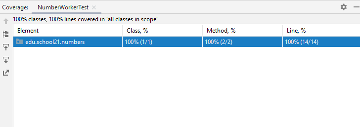

# Module-and-integration-testing
Изучение основ модульного и интеграционного тестирования с использованием JUnit 5 framework.

## Introduction
- Для написания программ использовалась версия Java 8.
- Отладка кода воспроизводилась на Intellij IDEA CE.
- Правила форматирования кода соответствуют общепринятым стандартам [Oracle](https://www.oracle.com/java/technologies/javase/codeconventions-namingconventions.html).
- Использован JUnit 5 framework во всех задачах.
- Использованы зависимости и плагины для обеспечения корректной работы:
    - maven-surefire-plugin
    - junit-jupiter-engine
    - junit-jupiter-params
    - junit-jupiter-api
    - hsqldb
    - mockito-core
- Все тесты запускаются с помощью команды mvn clean compile test.
- Исходный код тестируемого класса полностью покрыт во всех реализованных тестах.

Ниже приведен пример полной демонстрации использования IntelliJ IDEA для упражнения 00:



## Contents
1. [Exercise 00](#exercise-00)
2. [Exercise 01](#exercise-01)
3. [Exercise 02](#exercise-02)
4. [Exercise 03](#exercise-03)

### Exercise 00

- Программа расположена в директории: ex00;
- Корневая папка проекта: Test.

В упражнении реализован класс NumberWorker, который содержит следующую функциональность:

```java
public boolean isPrime(int number) {
  ...
}
public int digitsSum(int number) {
  ...
}
```

Метод isPrime(int number) определяет, является ли число простым, и возвращает значение true для простых чисел, иначе false. Для отрицательных чисел, а также 0 и 1 программа должна выдать непроверяемое исключение IllegalNumberException.

А метод digitsSum(int number) возвращает сумму цифр исходного номера.

Также был создан класс NumberWorkerTest, реализующий логику тестирования модуля. Методы класса NumberWorkerTest проверяют корректность работы методов NumberWorker для различных входных данных:

1. метод isPrimeForPrimes для проверки isPrime с использованием простых чисел
2. метод isPrimeForNotPrimes для проверки isPrime с использованием составных чисел
3. метод isPrimeForIncorrectNumbers для проверки isPrime с использованием неправильных чисел (0, 1, отрицательные)
4. метод проверки суммы цифр с использованием набора из не менее 10 чисел

Был подготовлен файл data.csv для метода 4, в котором указаны числа и через запятую их правильная сумма. Например: 1234, 10.

**Структура проекта**:

- Tests
    - src
        - main
            - java
                 - edu.school21.numbers
                    - NumberWorker
            - resources
        - test
            - java
                - edu.school21.numbers
                    - NumberWorkerTest
            - resources
                -	data.csv
    - pom.xml

### Exercise 01

- Программа расположена в директории: ex01;
- Корневая папка проекта: Test.

В этом упражнении написано интеграционное тестирование компонентов, взаимодействующих с БД. 

Реализован механизм создания DataSource для СУБД HSQL. Для этого к проекту подключены зависимости Spring-jdbc и hsqldb. Подготовлены файлы Schema.sql и data.sql, в которых описаны структуры таблицы продуктов и тестовые данные.

Структура таблицы продуктов:
- identifier
- name
- price

Создан класс EmbeddedDataSourceTest. В этом классе реализован метод init(), отмеченный аннотацией @BeforeEach и функциональность для создания источника данных с помощью EmbeddedDataBaseBuilder (класс из библиотеки Spring-jdbc). Написан простой тестовый метод для проверки возвращаемого значения метода getConnection(), созданного DataSource (это значение не должно быть нулевым).

**Структура проекта**:

- Tests
    - src
        - main
            - java
                - edu.school21.numbers
                    - NumberWorker
            - resources
        - test
            - java
                - edu.school21
                    - numbers
                        - NumberWorkerTest
                    - repositories
                        - EmbeddedDataSourceTest
            - resources
                -	data.csv
                -	schema.sql
                -	data.sql
    - pom.xml

### Exercise 02

- Программа расположена в директории: ex02;
- Корневая папка проекта: Test.

В этом упражнении реализована пара интерфейс/класс ProductsRepository/ProductsRepositoryJdbcImpl с помощью следующих методов:

```java
List<Product> findAll()

Optional<Product> findById(Long id)

void update(Product product)

void save(Product product)

void delete(Long id)
```

Также создан класс ProductsRepositoryJdbcImplTest, содержащий методы, проверяющие функциональность репозитория, с использованием базы данных в памяти, упомянутой в предыдущем упражнении. Заранее подготовлены объекты модели, которые будут использоваться для сравнения во всех тестах.

Объявления тестовых данных приведен ниже:

```java
class ProductsRepositoryJdbcImplTest {
    final List<Product> EXPECTED_FIND_ALL_PRODUCTS = Arrays.asList(
            new Product(1L, "bananas", 135),
            new Product(2L, "tangerines", 200),
            new Product(3L, "apples" , 95),
            new Product(4L, "pineapples", 250),
            new Product(5L, "figs", 300)
    );
    final Product EXPECTED_FIND_BY_ID_PRODUCT = new Product(4L, "pineapples", 250);
    final Product EXPECTED_UPDATED_PRODUCT = new Product(2L, "melon", 215);
    final Product EXPECTED_UPDATED_NULL_PRODUCT = new Product(2L, null, 0);
    final Product EXPECTED_SAVE_PRODUCT = new Product(6L, "watermelon", 220);
}
```

Каждый тест изолирован от поведения других тестов. Таким образом, перед запуском каждого теста БД находится в исходном состоянии.

**Структура проекта**:

- Tests
    - src
        - main
            - java
                - edu.school21
                    - numbers
                        - NumberWorker
                    - models
                        - Product
                    - repositories
                        - ProductsRepository
                        - ProductsRepositoryJdbcImpl
            - resources
        - test
            - java
                - edu.school21
                    - numbers
                        - NumberWorkerTest
                    - repositories
                        - EmbeddedDataSourceTest
                        - ProductsRepositoryJdbcImplTest
            - resources
                -	data.csv
                -	schema.sql
                -	data.sql
    - pom.xml

### Exercise 03

- Программа расположена в директории: ex03;
- Корневая папка проекта: Test.

В этом упражнении реализован уровень бизнес-логики, представленный классом UsersServiceImpl. Этот класс содержит логику аутентификации пользователя. Он также зависит от интерфейса UsersRepository (в этой задаче не было необходимости его реализовывать).

Интерфейс UsersRepository содержит следующие методы:

```java
User findByLogin(String login);
void update(User user);
```

Метод findByLogin возвращает объект User, найденный при входе в систему, или выдает EntityNotFoundException, если не найден ни один пользователь с указанным именем входа. Метод update выдает аналогичное исключение при обновлении пользователя, которого нет в базе данных.

Пользовательская сущность содержит следующие поля:
- Identifier
- Login
- Password
- Authentication success status (true - authenticated, false - not authenticated)

В свою очередь класс UsersServiceImpl вызывает эти методы внутри функции аутентификации:

```java
boolean authenticate(String login, String password)
```

Этот метод:
1. Проверяет, прошел ли пользователь аутентификацию в системе под данным логином. Если аутентификация была выполнена, необходимо создать исключение AlwaysAuthenticatedException.
2. Пользователь с этим логином извлекается из UsersRepository.
3. Если полученный пароль пользователя соответствует указанному паролю, метод устанавливает статус успешной аутентификации пользователя, обновляет его информацию в базе данных и возвращает true. Если пароли не совпадают, метод возвращает false.

Поскольку цель — проверить корректность работы метода аутентификации независимо от компонента UsersRepository, был использован макет объекта и заглушки методов findByLogin и update из библиотеки Mockito.

Метод аутентификации проверяется в трех случаях:
1. Правильный логин/пароль
2. Неверный логин
3. Неправильный пароль.

**Структура проекта**:

- Tests
    - src
        - main
            - java
                - edu.school21
                    - exceptions
                        - AlreadyAuthenticatedException
                    - numbers
                        - NumberWorker
                    - models
                        - Product
                        - User
                    - services
                        - UsersServiceImpl
                    - repositories
                        - ProductsRepository
                        - ProductsRepositoryJdbcImpl
                        - UsersRepository
            - resources
        - test
            - java
                - edu.school21
                    - services
                        - UsersServiceImplTest
                    - numbers
                        - NumberWorkerTest
                    - repositories
                        - EmbeddedDataSourceTest
                        - ProductsRepositoryJdbcImplTest
            - resources
                -	data.csv
                -	schema.sql
                -	data.sql
    - pom.xml
